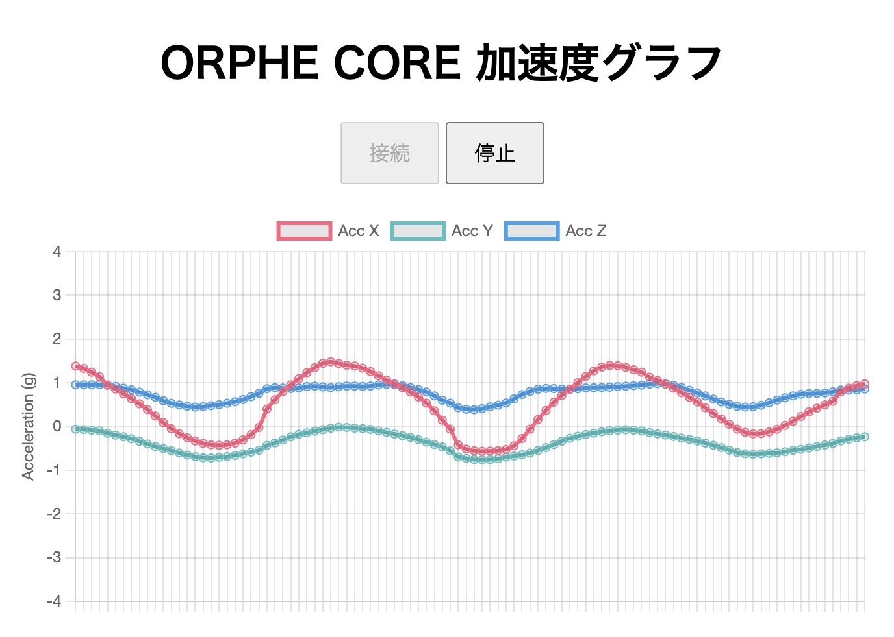
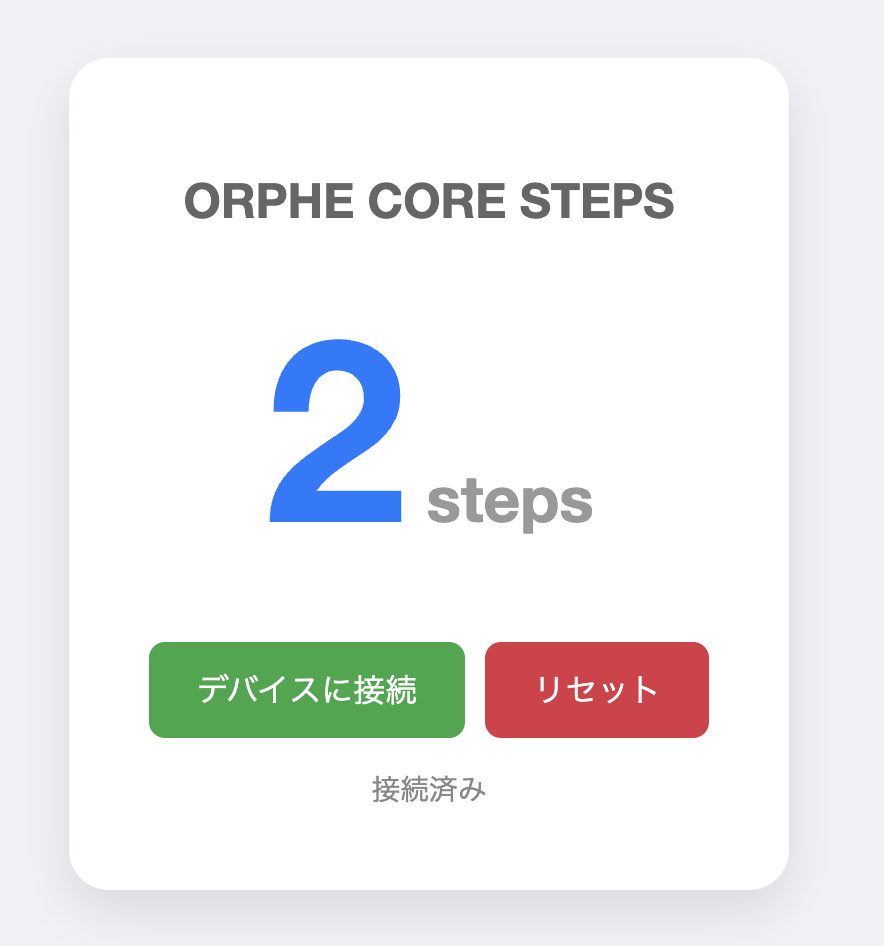
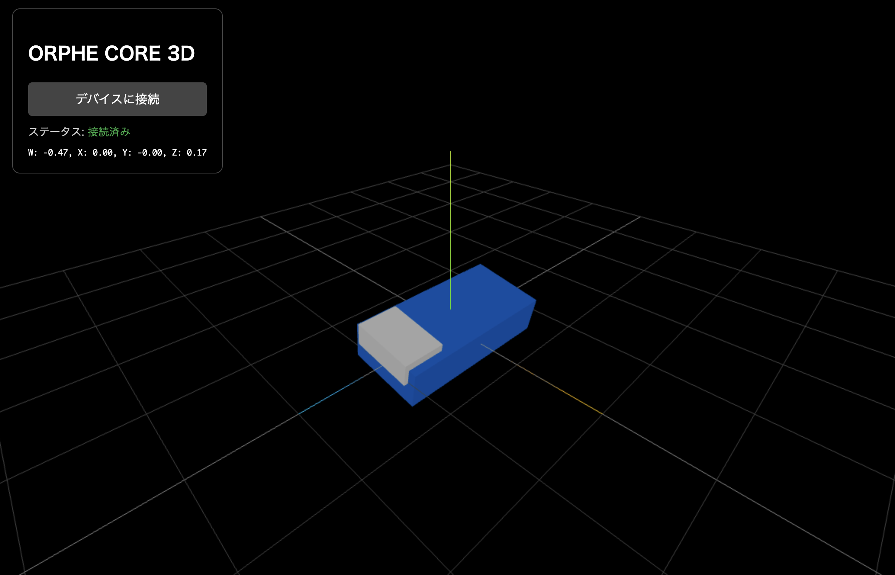

# ichigeki-orphe-core

このプロジェクトは、ORPHE CORE（BLE接続モーションセンサ）を AI Agent（GitHub Copilot, Cursor, Windsurf 等）を用いて開発することに特化したテンプレートリポジトリです。

## 特徴

- **AI Agent 最適化**: `.github/instructions/orphe.instructions.md` や `.agent/rules/orphe.md` に ORPHE CORE JS ライブラリの使い方が定義されており、AI Agent がライブラリの仕様を即座に理解してコードを生成できます。
- **マルチエディタ対応**: GitHub Copilot だけでなく、Google の AI エディタである **Antigravity** にも対応しており、`.agent/` ディレクトリ内の設定ファイルによって高度なコード生成が可能です。
- **一撃でアプリ作成**: 複雑な BLE 通信の知識がなくても、自然言語の指示だけで ORPHE CORE を活用したアプリケーションを構築可能です。

## デモ例

例えば、以下のようなプロンプトを入力するだけで、アプリケーションが自動生成されます。

### 1. 加速度センサのグラフ表示
「ORPHE COREの加速度センサをグラフ表示するアプリを作成して。」

### 2. 歩数カウント表示
「歩数をカウントして画面に大きく表示して」

### 3. 3Dモデルへの反映
「足の傾き（クォータニオン）を 3D モデルに反映させて」

## 使い方

1. このリポジトリをクローンまたはテンプレートとして使用します。
2. AI Agent（GitHub Copilot 等）に対し、作成したいアプリの機能を日本語で指示します。
   - 例：「歩数をカウントして画面に大きく表示して」
   - 例：「足の傾き（クォータニオン）を 3D モデルに反映させて」
3. 生成された `index.html` をブラウザで開き、ORPHE CORE と接続して動作を確認します。

## プロジェクト構造

- `src/ORPHE-CORE.js`: ORPHE CORE JS ライブラリ本体
- `.github/instructions/orphe.instructions.md`: GitHub Copilot 等の AI Agent 向けの指示書
- `.agent/rules/orphe.md`: Antigravity (Google AI Editor) 向けの指示書
- `index.html`: 生成されたアプリケーション（初期状態は加速度グラフの例）
- `images/`: ドキュメント用画像
